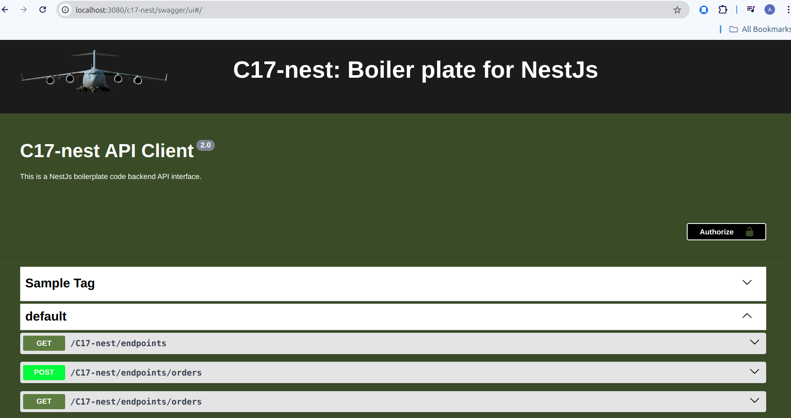
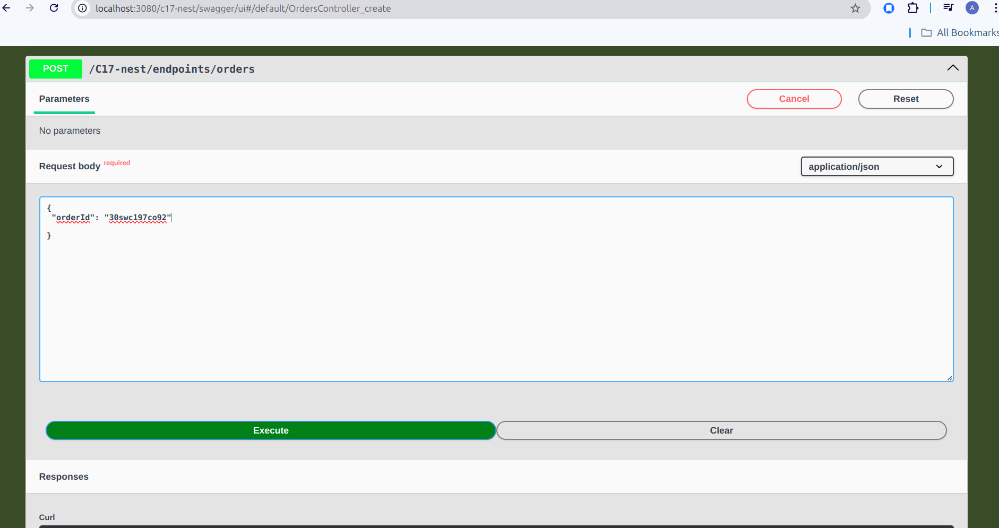

# NestJS TypeScript Starter

A powerful and flexible NestJS starter repository, designed with best practices for scalable backend development. This project showcases integration of multiple databases, environment configuration using ENV files, and additional utilities for seamless development.



## Features

- **TypeScript & NestJS**: Full support for TypeScript, providing type safety and cleaner code.
- **Configuration Management**: Centralized configuration management using env files, with environment-based validation using **Joi**.
- **Database Integration**:
  - **Postgres** and **MySQL** databases integrated with dynamic configuration and initialization.
  - Entity separation based on database type.
  - Logging integrated for database connectivity status and query performance.
- **Caching Service**: Integrated **Redis** caching service with logging to monitor connectivity and cache activity.
- **Swagger UI**: Fully customized **Swagger UI** for API documentation, tailored to the project needs.

## Installation

### Prerequisites

Ensure you have the following installed on your machine:
- **Node.js**: v14.x or above
- **Postgres**: v12.x or above
- **MySQL**: v8.x or above
- **Redis**: v6.x or above

### Clone the Repository

```bash
git@github.com:para-commando/C17-Nest.git
```

```bash
cd C17-Nest
```

### Install Dependencies

```bash
npm install
```

### Configure the Application

1. Create a .env.local file in the config directory with the necessary secret values.

2. Ensure all secrets and configurations are validated using Joi schema validation.

### Running the Application

```bash
npm run start:dev
```
See the terminal to get the swagger ui link post successful launch

## Improvements

The scope of this boilerplate can be expanded by integrating **Apache Kafka**, **Redis Streams**, **WebSockets**, and **TCP connection**-based use cases. For more details, please refer to this project of mine: 
<a href="https://github.com/para-commando/Fault-Tolerant-Decoupled-Microservice-Arch">Fault-Tolerant Decoupled Microservice Architecture</a>.
